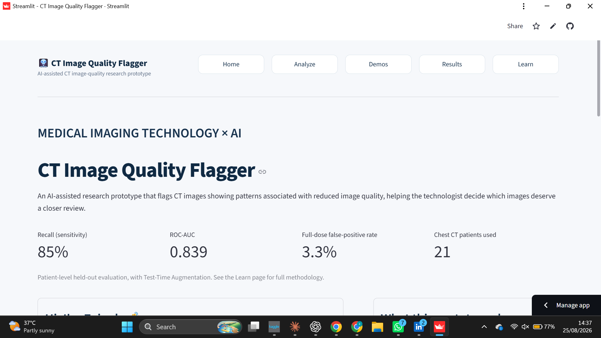
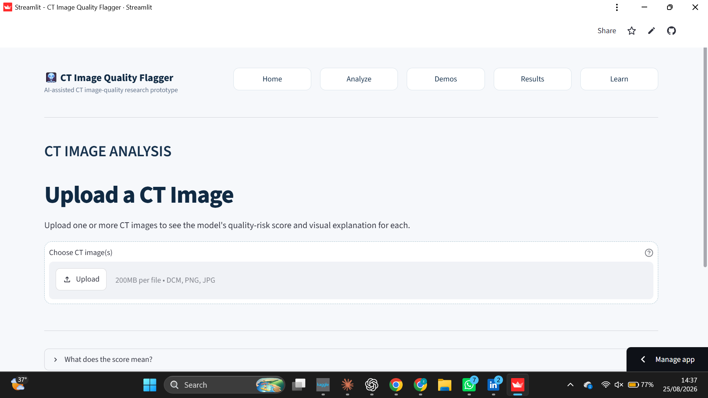
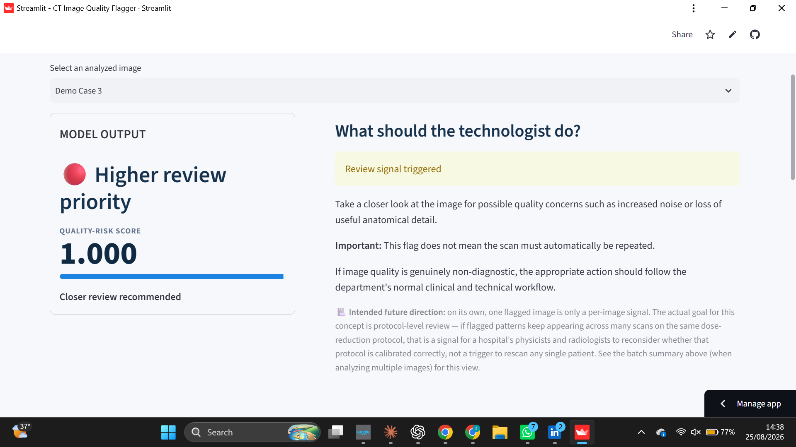
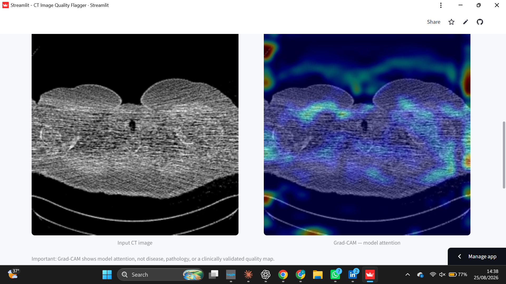
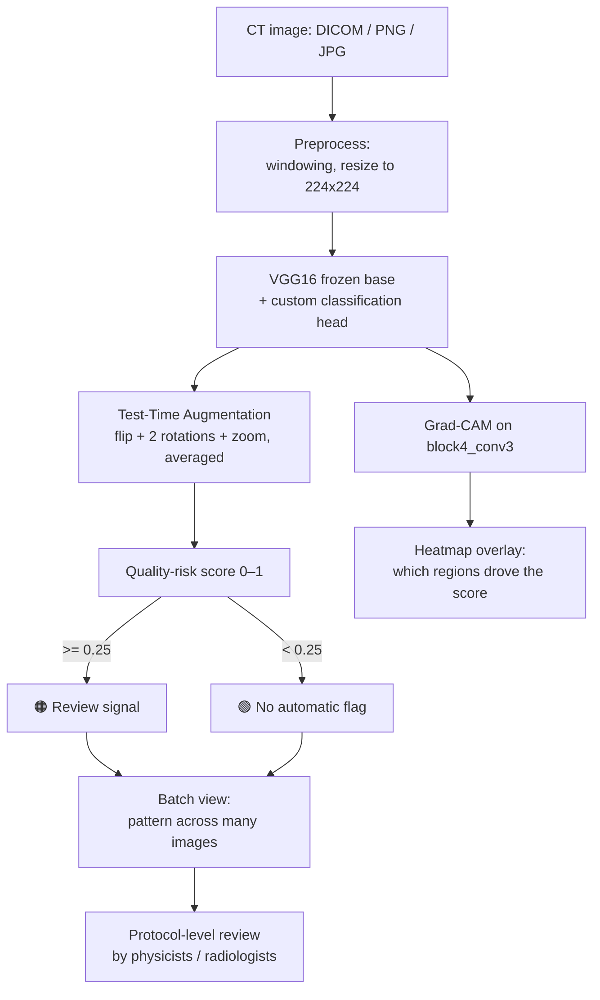

<div align="center">

# 🩻 CT Image Quality Flagger

**An AI-assisted decision-support prototype that flags CT images showing patterns associated with reduced image quality after dose reduction.**

Built independently — no mentor, no hospital access, no coding background at the start — as a Medical Imaging Technology student research project.

[](https://ct-image-quality-flagger.streamlit.app/)
[](https://huggingface.co/zainabfatima9/ct-image-quality-flagger)


</div>

---

## 📸 See it in action


<div align="center">

| Home | Analyze |
|---|---|
|  |  |

| Results — flagged case | Grad-CAM explanation |
|---|---|
|  |  |

</div>

---

## 📑 Table of contents

- [The story](#-the-story)
- [The problem](#-the-problem)
- [What the app does](#-what-the-app-does)
- [How it's meant to be used](#-how-its-meant-to-be-used--protocol-level-not-per-patient)
- [Why this project fits Medical Technology & Healthcare Business](#-why-this-project-fits-medical-technology--healthcare-business)
- [How it works — pipeline overview](#-how-it-works--pipeline-overview)
- [The build journey](#-the-build-journey-things-that-didnt-work-first-time)
- [Dataset & methodology](#-dataset--methodology)
- [Results](#-results)
- [Explainability — Grad-CAM](#-explainability--grad-cam)
- [Tech stack](#-tech-stack)
- [Project structure](#-project-structure)
- [Running it locally](#-Running-it-locally)
- [Limitations, honestly](#-limitations-honestly)
- [Future work](#-future-work)
- [References](#-references)
- [About the author](#-about-the-author)

---

## 💡 The story

Hi, I'm Zainab — a Medical Imaging Technology student. I didn't have access to a hospital, a research mentor, or a supervised lab for this project. I also didn't know how to code when I started. Everything here — the data pipeline, the model, the deployed app — was built independently, largely self-taught along the way, using only publicly available data.

This project started from one simple, practical question I kept running into while learning about CT imaging:

> **When a hospital reduces CT radiation dose, how would anyone actually notice if they've reduced it too much?**

In a well-resourced setting, a physicist periodically audits image quality against Diagnostic Reference Levels. In many settings — including much of Pakistan, where CT dose practice has been shown to vary widely and formal reference levels are still being established — that kind of continuous audit is hard to sustain. That gap is what this prototype tries to explore, in a small, honest, proof-of-concept way.

---

## 🎯 The problem

CT dose optimization is not simply "use less radiation." Reducing dose increases image noise, and past a certain point, that noise starts to compromise diagnostic image quality. Finding the right balance — enough dose reduction to protect the patient, not so much that images become unreliable — is itself a formal concept in radiology called **Acceptable Quality Dose (AQD)**.

Pakistan-specific research (Yaseen et al., 2024 — see [References](#-references)) has documented exactly this challenge: wide CT dose variation across institutions, and the absence, until recently, of locally established Diagnostic Reference Levels. That's the real-world backdrop this project is designed around.

**The question this prototype explores:** *can an AI model, looking only at a CT image, learn to flag images whose quality has likely degraded from dose reduction — well enough to be a useful supporting signal?*

---

## 🩻 What the app does

- **Analyzes a CT image** — upload a DICOM, PNG, or JPG
- **Produces a quality-risk score** from 0 to 1, using a VGG16 transfer-learning model with Test-Time Augmentation (TTA)
- **Shows a Grad-CAM heatmap** so the result isn't a black box — you can see which regions of the image influenced the score
- **Reads DICOM metadata** (tube voltage, tube current, exposure, slice thickness, etc.) when available
- **Summarizes patterns across a batch** of images — because a single flagged image isn't really the point (see below)

---

## 🏥 How it's meant to be used — protocol-level, not per-patient

This is the part that's easy to misread, so it's worth stating plainly.

**A single flagged image is *not* a signal to automatically repeat that patient's scan.** By the time an image exists, the dose has already been delivered — flagging it after the fact doesn't undo that.

The actual intended use is at the **protocol level**: if flagged patterns keep showing up across *many* scans run on the same dose-reduction protocol, that's a signal for a hospital's physicists and radiologists to reconsider whether that protocol is calibrated correctly for future patients — the same balancing act described by the AQD concept above.

This tool only ever supplies the **image-quality (lower-bound) signal**. It never decides the final radiation dose — that decision stays with physicists and radiologists, who weigh this signal against separately established Diagnostic Reference Levels (the radiation-safety upper bound). Same-visit immediate review or radiologist-flagging are reasonable secondary uses; automatic per-patient rescanning is not the design intent.

---

## 🎓 Why this project fits Medical Technology & Healthcare Business

This project sits deliberately at the intersection of three things, rather than being a pure machine-learning exercise:

- **Technology** — applying AI directly to an existing piece of diagnostic equipment's workflow (CT), rather than building a standalone algorithm with no path into a hospital's actual process.
- **Healthcare business & operations** — the underlying case is economic as much as clinical. Manual, slice-by-slice image-quality auditing doesn't scale; a hospital adopting a new dose-reduction protocol has no fast way to know if it went too far until problems surface downstream. A lightweight, low-cost, protocol-level flagging layer is the kind of intervention a healthcare-technology manager — not just a radiologist — would need to evaluate: what does it cost to run, what does it save in avoided rework or complications, and how does it fit into an existing QA workflow rather than replacing it?
- **Policy & regulatory context** — this project was built alongside a separate review of regulatory and workforce gaps facing medical imaging technologists in Pakistan (covering the Allied Health Professionals Council's delayed enforcement and the documented absence of local Diagnostic Reference Levels). The two projects share a premise: in settings where formal oversight infrastructure is still developing, well-designed low-cost tools can partially fill real gaps — but only if paired with an honest understanding of what they can't do, which is why this README is explicit about limitations rather than overselling the prototype.

Built entirely on free, public data (TCIA) and free compute (Google Colab), this project also reflects a resource-constrained design philosophy deliberately — the same constraint many healthcare systems that would actually benefit from a tool like this are working under.

---

## ⚙️ How it works — pipeline overview



---

## 🛠 The build journey — things that didn't work first time

This project didn't come together in a straight line, and I think that's worth documenting rather than hiding:

1. **The "obvious" dataset split had a hidden trap.** Randomly picking patients from LDCT-and-Projection-data mixed full-dose-only scanner data with properly paired scans, and the NBIA search UI wouldn't hold both filters I needed at once — I had to manually verify and hand-pick 8, then 13, then 21 chest patients with genuinely paired Full Dose / Low Dose images.

2. **Full Dose and Low Dose DICOM headers are identical.** KVP, tube current, exposure — all the same. The "low dose" images were simulated via noise injection on the original scan, not a second real acquisition. That meant the quality label had to come from the *pixel data itself*, not the metadata — so I built a noise-quantification pipeline comparing HU values between paired images.

3. **My first labeling approach was quietly wrong.** A global noise-threshold label mostly reflected *which patient* a slice came from (some patients just have noisier anatomy at baseline) rather than genuine dose-related quality loss. Fixing this required per-patient z-score normalization before thresholding — a small change that made a large difference to what the model actually learned.

4. **More data didn't automatically help.** Expanding from 13 to 21 patients initially made the model *worse* (F1 dropped). A few more training epochs on the same expanded set fixed it and pushed recall up meaningfully — a reminder that "more data" and "trained enough on that data" are two different things.

5. **Fancier didn't beat simpler.** I tried ensembling two model versions and fine-tuning VGG16's last layers — neither beat the plain augmented model. The final model is the "boring" one, on purpose.

6. **The deployed app initially reported the wrong numbers.** An early version of the live app computed its score using a manually reconstructed Grad-CAM classifier instead of the real model, and skipped TTA entirely — meaning the deployed score didn't actually match the 85% recall I'd measured. Caught and fixed before calling this "done."

---

## 📊 Dataset & methodology

- **Dataset:** [LDCT-and-Projection-data](https://www.cancerimagingarchive.net/) (The Cancer Imaging Archive) — public chest CT data with paired Full Dose and simulated Low Dose acquisitions
- **Final patient set:** 21 paired chest CT patients, 4,472+ slices, strict **patient-level** train/test split (no patient's slices appear in both sets — this matters, since slice-level leakage would make results look better than they are)
- **Labeling:** per-slice noise = std. dev. of (Low Dose HU − Full Dose HU) inside a body mask, **per-patient z-score normalized**, then thresholded at the 75th percentile → `Review_Flag` vs `Acceptable`
- **Model:** VGG16 (frozen convolutional base) + custom classification head, class-weighted for imbalance, trained with augmentation (rotation, shift, zoom, flip, brightness)
- **Inference:** Test-Time Augmentation — 5 augmented views averaged per prediction
- **Explainability:** Grad-CAM (`block4_conv3`, cubic-interpolated) + t-SNE visualization of the learned feature space

---

## 📈 Results

Measured on **held-out test patients never seen during training**:

| Metric | Value |
|---|---|
| Recall (sensitivity) | **85%** |
| Precision | 54% |
| F1-score | 0.66 |
| ROC-AUC | **0.839** |
| False-positive rate on full-dose (undegraded) images | 3.3% |

**Sanity check:** running the model on undegraded full-dose images from held-out patients produced a near-zero flag rate — evidence the model learned genuine dose-related degradation, not spurious patterns.

**Why recall over precision:** the threshold (0.25) was chosen deliberately. In a clinical-flagging context, missing a genuinely bad-quality image (false negative) is worse than an unnecessary review flag (false positive) — so the model is tuned to lean toward catching more true issues at the cost of some extra false alarms.

---

## 👁️ Explainability — Grad-CAM

> Add a side-by-side example here once you have one: `assets/gradcam-example.png` — an input CT slice next to its Grad-CAM heatmap.


Grad-CAM heatmaps consistently concentrate on soft-tissue and organ-boundary regions rather than background — suggesting the model weighs noise by its impact on diagnostically relevant structures, rather than just raw noise magnitude. This doesn't prove clinical relevance on its own, but it's a much more reassuring signal than a model that lights up random background pixels.

---

## 🧰 Tech stack

| Layer | Tools |
|---|---|
| Modeling | TensorFlow / Keras (VGG16 transfer learning), scikit-learn |
| Image handling | pydicom, OpenCV, Pillow |
| Experimentation | Google Colab, Google Drive |
| App | Streamlit |
| Model hosting | Hugging Face Hub |
| Deployment | Streamlit Community Cloud |

---

## 📁 Project structure

```
.
├── app.py                  # Streamlit app (Home / Analyze / Demos / Results / Learn)
├── sample_images/          # Demo case images shown on the Demos page
├── assets/                 # Screenshots and images used in this README
├── requirements.txt        # Python dependencies
└── README.md
```

---

## ▶️ Running it locally

```bash
git clone https://github.com/Zainabfatima9/ct-image-quality-flagger.git
cd ct-image-quality-flagger
pip install -r requirements.txt
streamlit run app.py
```

The app downloads the trained model automatically from Hugging Face Hub on first run — no manual model download needed.

---

## ⚠️ Limitations, honestly

- **The dataset's dose reduction is more obvious than real life.** LDCT-and-Projection-data uses aggressive simulated dose reduction for research purposes; real-world reductions are typically much subtler. This is a proof-of-concept on a clearer case, not evidence the model beats manual review on subtle, realistic degradation.
- **Precision is moderate (54%).** Roughly half of flagged images wouldn't be judged genuinely problematic on closer review. That's a reasonable trade-off for a screening tool tuned toward recall, but a real limitation worth stating plainly rather than glossing over.
- **This is a research prototype, not a clinical tool.** It has not been clinically validated and must not be used to diagnose patients, reject clinical scans, or independently change CT radiation-dose protocols.

---

## 🔭 Future work

- Validate on subtler, more realistic dose variations across different scanners, patients, and institutions
- Test the protocol-level aggregation idea on a real (simulated) multi-scan batch, closer to how a hospital audit would actually use it
- Extend beyond chest CT to other anatomical regions
- Explore lighter-weight architectures for feasibility on lower-resource hardware

---

## 📚 References

Yaseen, M., Nishtar, T., Kharita, M.H., et al. *Development of Acceptable Quality Dose (AQD) and image quality-related diagnostic reference levels for common computed tomography investigations in a tertiary care public sector hospital of Khyber Pakhtunkhwa, Pakistan.* Japanese Journal of Radiology, 42, 1479–1492 (2024). https://doi.org/10.1007/s11604-024-01627-y

*(Cited for its dose-optimization framing — AQD/DRL — not as a source of training data. Training data is the separate, public LDCT-and-Projection-data archive linked above.)*

---

## 👋 About the author

**Zainab Fatima** — Medical Imaging Technology student, building at the intersection of medical imaging, AI, and healthcare systems. This project was built independently, without institutional data access, as part of an application to the **Erasmus Mundus Medical Technology and Healthcare Business (EMMaH)** program.

📫https://www.linkedin.com/in/zainab-fatima-03aab23a8?utm_source=share_via&utm_content=profile&utm_medium=member_android

📧zf7767027@gmail.com
